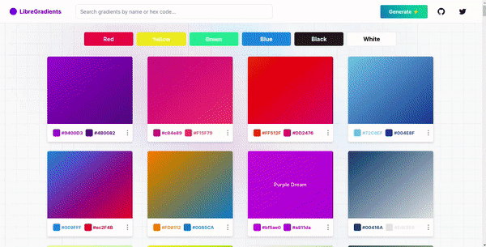

# LibreGradients

LibreGradient is an open-source collections of beautiful gradients for your next project.

The goal of LibreGradients is to provide everyone with free access to a collection of beautiful and modern gradients.

Official site: [https://libre-gradients.vercel.app](https://libre-gradients.vercel.app)

## ⚒️ Demo
Browse through a list of over 284 beautiful and modern gradients.

 

## ⭐ Features 
It has 5 Core Features:
| 
**Feature**
 | **Description** |
|---|---|
| **1. Copy CSS Code** | You can easily copy the CSS code of any gradient you select |
| **2.  In-built Editor** | Easily customize your gradients to fit your specific use-case.|
| **3. Palette Extractor** | Upload any image of your choice and with our extractor, we can generate beautiful color palettes for you |
| **4. Powerful search** | Download any gradient in PNG formats  locally to your computer  (more formats coming soon)|
| **5. Easy Search** | Easily search gradients by name of hex code |

## 📚 Tech Stack

| 
**Category**
 | 
**Choice**
 | **Descriptions** |
|---|---|---|
| **Language** | [TypeScript](https://github.com/microsoft/TypeScript) | TypeScript is JavaScript with static type checking and helps catch many silly bugs at code time. |
| **UI Library** | [React](https://github.com/facebook/react) | React’s declarative syntax and component-based architecture make it simple to develop reactive reusable components. |
| **State Management** | [Zustand](https://github.com/reduxjs/redux-toolkit) | Zustand is a small, fast and scalable bearbones state-management solution, it has a comfy api based on hooks. |
| **CSS Framework** | [Tailwind CSS](https://github.com/tailwindlabs/tailwindcss) | Tailwind speeds up development by providing helpful css utilities and removing the need to context switch between tsx and css files. |
| **Web Framework** | [NextJS 13](https://github.com/vercel/next.js) | Next.js supports static site generation and helps build efficient React webpages that support SEO. |

## 📁 Project Structure

OpenResume is created with the NextJS web framework and follows its project structure. 

| 
**Page Route**
 | **Code Path** | **Description** |
|---|---|---|
| / | /index.tsx | Home page that contains the list of all gradients |
| /components | /components| Contains all the components used in the project |
| /ui | /ui/| Contains radix and shadcn ui utility components |
| /generate | /generate.tsx/| Contains logic for extracting colors from images |
| /[color] | /[color].tsx/| Individual page for each gradient |

## 💻 Local Development

1. Download the repo `git clone hhttps://github.com/urdadx/Gradients-Ninja.git`
2. Change the directory `cd Gradients-Ninja`
3. Install the dependency `npm install`
4. Start a development server `npm run dev`
5. Open your browser and visit [http://localhost:3000](http://localhost:3000) to see LibreGradients live

## Contributing 🤝
Anyone is free to contribute to this project. Open an issue on bugs/features or send a pull request for review.

## Give this repo a star ⭐.
